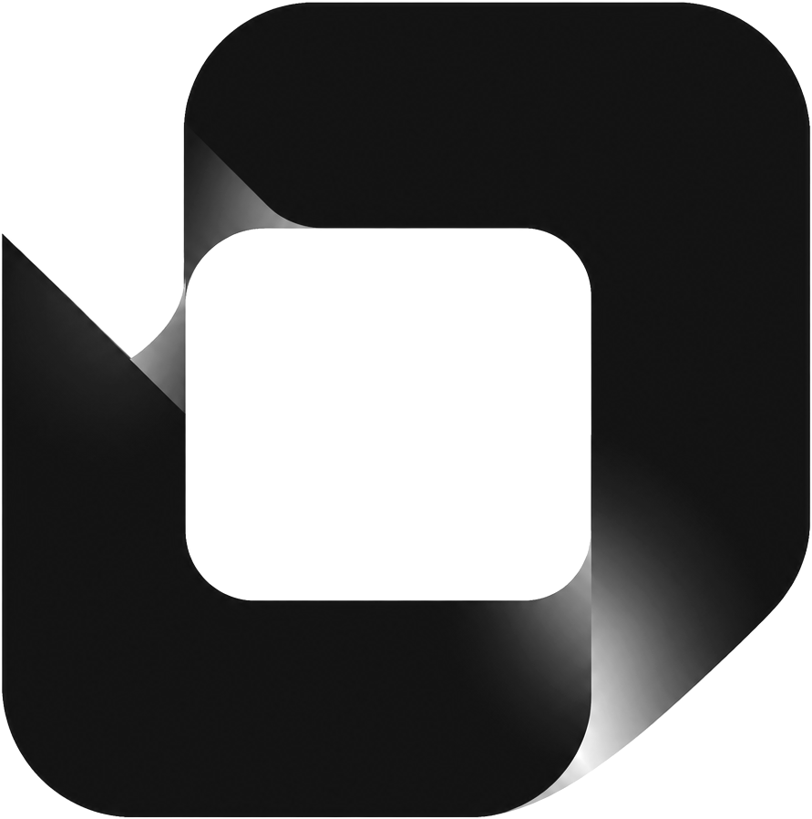
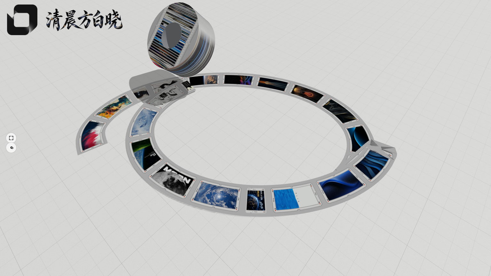
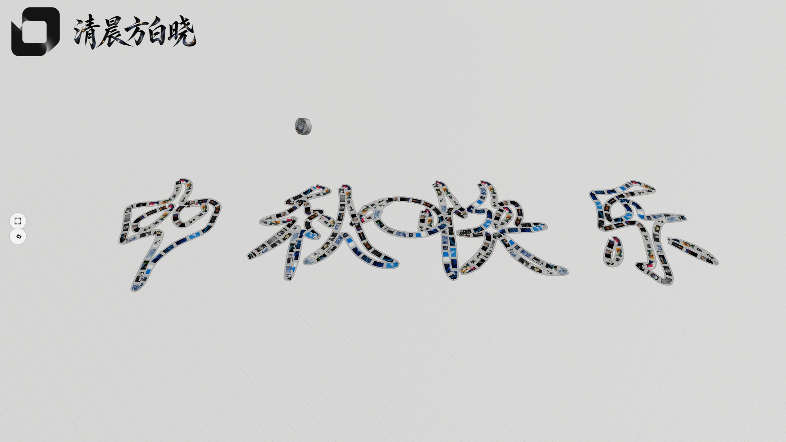

<div align="center">




# Tape Space · 贴纸胶带动画生成器

**一个 AI Agent Skill：把你的贴纸 PNG 变成可直接发布的 three.js「拉胶带」交互作品。**

纯拖拽画布 · 无限地面 · 镜头跟带 · 自动写字 · 沉浸模式。

</div>



## 这是什么

给 skill 一文件夹贴纸 PNG（每张 = 一卷新胶带），它产出一个自包含的项目：

- **实时胶带条** —— 跟随鼠标的 `DynamicDrawUsage` 缎带，宽 4 世界单位，`v = 弧长 / uvLength` 贴图重复
- **转角平滑 + 堆叠抬升** —— 尖角三点均值平滑；胶带交叉处每层 `+0.004` 物理堆叠
- **带卷跟随** —— 胶带卷骑在带尾滚动行进（程序生成网格，也可挂你自己的 `.glb`）
- **无限画布** —— 地面随相机无限延伸，随处可画；路径自动回中保 float32 精度
- **镜头跟带** —— 带尾出屏，镜头贴地平滑跟随；倒带 / 清空自动回位
- **中键提笔** —— 按中键钉住当前段为独立胶带，拖卷留白，再按续画（胶带断点）
- **滚轮缩放** —— 以屏幕中心为焦点推拉，缩出去漫游整幅画
- **快捷键自动写字** —— 词 → 轮廓提取（marching squares）→ 沿笔画自动铺带成字，支持中文双钩 / 拉丁比例排版，↑/↓ 实时变速
- **倒带 / 轨道** —— `Space` 倒带当前路径，`Tab` 切换 orbit
- **列表模式** —— 点底部条 → 相机补间 + RGB 分离 glitch → 自动铺带；hover 换贴纸重画，滚动甩尾开新向
- **沉浸模式** —— 按 `I` 自动铺带→停顿→倒带循环播放，任何操作立即还权
- **全屏 + 干净画面** —— 左缘按钮进全屏隐藏全部文字层，只留 3D 与左上角署名；`S` 键显隐文字
- **设置面板** —— 写字速度 / 文字大小 / logo 高 / 署名高，滑杆即调，localStorage 持久化
- **个人 IP 区** —— 左上角常驻 logo + 书法署名图（透明底 PNG），缺图回退瘦金风英文书法体文字（Tangerine，OFL 授权，本地自托管）
- **优雅降级** —— 低端机分档降画质；30s keep-alive 渲染循环



## 快速开始

```bash
git clone <本仓库>
cd skills/sticker-tape-animation/assets-template
node ../scripts/serve.mjs . 8899
# 打开 http://localhost:8899 —— 零素材也能跑：贴纸/带身/地面全部程序生成
```

把自己的贴纸放进 `assets-template/stickers/`，在 `config.js` 的 `stickers: []` 里登记路径，即换即得。

### 作为 Agent Skill 使用（推荐）

把 `skills/sticker-tape-animation/` 拷进技能目录：

- **全局：** `~/.qoder/skills/sticker-tape-animation/`
- **项目内：** `<repo>/.qoder/skills/sticker-tape-animation/`

重新加载后调用：

```
/sticker-tape-animation path/to/your/stickers/
```

## 操作一览

| 操作 | 效果 |
|---|---|
| 拖拽鼠标 | 拉出胶带 |
| 中键 | 提笔（断点）/ 落笔续画 |
| 滚轮 | 缩放漫游 |
| `Z`（可配多键多词） | 自动写字，书写中再按 = 立即写完 |
| `↑` / `↓` | 写字速度 ±0.25（0.05 ~ 10） |
| `Space` | 倒带 / 钉住当前段 |
| `Tab` | orbit 轨道视角 |
| 点底部条 | 进项目列表（glitch 转场） |
| `S` | 显隐全部文字层（署名常驻） |
| `I` | 沉浸模式（自动播放，任意操作退出） |
| 左缘按钮 | 全屏（隐藏文字层，`ESC` 退出） |

## 配置都在 config.js

手感 / 素材 / 文案全部集中在 `assets-template/config.js`，无需碰 `src/`：

| 键 | 作用 |
|---|---|
| `stickers[]` | 带身贴图列表（每张 PNG = 一卷新胶带） |
| `tapeWidth` `uvLength` | 带宽与贴图重复 |
| `infiniteGround` `cameraFollow` `wheelZoom` `tapeBreak` | 无限画布 / 跟带 / 缩放 / 提笔开关 |
| `autoWrite.texts` | 按键 → 词 映射（如 `{ KeyZ: 'HELLO' }`） |
| `brand.logo / wordmark / mark` | 左上角个人 IP：logo 图 + 署名图 + 文字回退 |
| `brand.splashLines` | 冷启动大标题轮换（顺序或随机） |
| `background` `groundTexture` | 背景色 / 满屏背景图 / 地面图 |
| `immersive` `fullscreen` `ui` | 沉浸、全屏、文字显隐 |

运行时 API（控制台直接调）：`window.autoWriteText('词')`、`window.setBackgroundColor('#101418')`、`window.enterListViewMode('right')`、`window.tapeEngine`。

## 关于作者

**清晨方白晓** —— 设计与代码。

- GitHub: [@csuyincs-creator](https://github.com/csuyincs-creator)

## License

[MIT](LICENSE) © 2026 清晨方白晓 (Qingchen Fangbaixiao)
